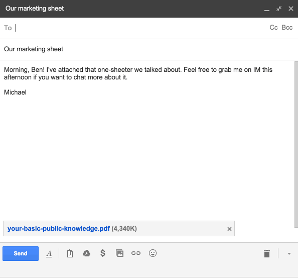

One of my biggest fears when sending an internal email is that I might
mistakenly send it to folks outside the company. Guardrails for Gmail is
a lightweight browser extension that fixes that.

Here's how it works:

Compatible with Google Chrome and Safari, Guardrails will give you a heads up
when you're sending an email to folks outside your organization or mixing
external people in with internal contacts. It'll also give you some peace of
mind when you're only talking to people in your own organization.

## Installation

**Chrome**

You can [install Guardrails from the Chrome Web Store](https://chrome.google.com/webstore/detail/guardrails-for-gmail-and/aajaelpbgbcafefckkgfnimmblenbfje).

**Safari**

Safari will probably require a bit of finagling to get working.
[Read more on running user scripts in Safari](http://www.simplehelp.net/2007/11/14/how-to-run-greasemonkey-scripts-in-safari/).

If you find out how to make this work, a pull request for this README is much
appreciated!

## Thanks

Special shout out to the folks at [Streak](https://www.streak.com/) for making
[InboxSDK](https://www.inboxsdk.com/). InboxSDK is the developer toolkit Gmail
should've always shipped with. It abstracts away navigating the ever-changing
Gmail DOM, adding consistent UI, and watching for events. I wouldn't have
bothered even thinking about making this without them.
